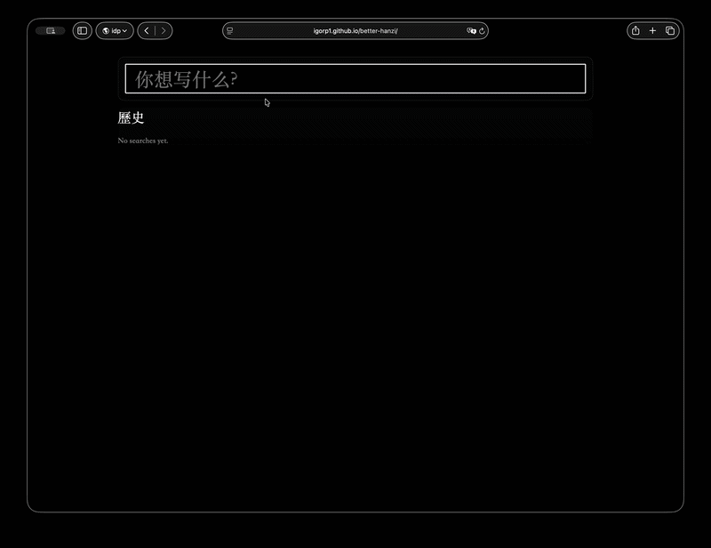

## Better Hanzi



Next.js 16 + Bun app for stroke-order practice using `hanzi-writer-data`.

## Local development

```bash
bun install
bun dev
```

`bun dev` automatically syncs `hanzi-writer-data` into `public/hanzi` through `scripts/sync-hanzi-data.mjs`.

## Production build

```bash
bun run build
```

The app is configured with `output: "export"` for static hosting.

## GitHub Pages

Deploy workflow: `.github/workflows/deploy-pages.yml`

- Triggers on push to `main`
- Builds static `out/` output
- Publishes with `actions/deploy-pages`

For GitHub Pages to serve the site:

1. In GitHub repo settings, open **Pages**.
2. Set **Source** to **GitHub Actions**.

`next.config.ts` auto-sets `basePath` from `GITHUB_REPOSITORY` in GitHub Actions.
